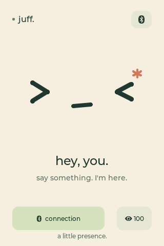
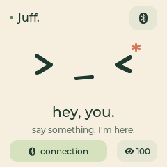

# JUFF: an ESP32-S3 × Qwen real-time voice companion

[简体中文](README.md) · [Architecture](docs/architecture.md) · [Firmware](firmware/README.md) · [Contributing](CONTRIBUTING.md)

| 3.5-inch · 320×480 | 1.54-inch · 240×240 |
| :---: | :---: |
|  |  |

*Rendered from the current firmware UI at each display's native resolution.*

JUFF turns the Waveshare **ESP32-S3-Touch-LCD-3.5 / 1.54** into a touch-enabled,
real-time voice terminal. Its default transport is encrypted Bluetooth LE:
the ESP32 streams microphone audio to a Mac, `qwen-audio-agent` talks to
DashScope, and the spoken response is streamed back to the onboard speaker.

Wi-Fi/WebSocket remains available as an optional fallback. The DashScope API
key stays on the Mac and is never provisioned to the ESP32.

> JUFF is a hardware prototype. Select the firmware profile for your board. It is
> not an official Alibaba Cloud, Qwen, or Waveshare project.

## Supported hardware

| Board | Display and touch | Audio |
| --- | --- | --- |
| ESP32-S3-Touch-LCD-3.5 | ST7796, 320×480, FT6336 | ES8311 input/output, amplifier via TCA9554 |
| ESP32-S3-Touch-LCD-1.54 | ST7789, 240×240, CST816 | ES7210 input, ES8311 output, amplifier on GPIO 7 |

Both use an ESP32-S3 with 16 MB flash and 8 MB octal PSRAM. The 1.54-inch
profile keeps voice, interruption, brightness, and BLE pairing in a compact UI.

The repository defaults disable local AEC/VAD voice interruption on both boards.
Audio is half-duplex: microphone upload pauses during playback, and touch or
GPIO 0 stops the response manually. Both hardware profiles support explicitly
enabling experimental voice interruption through the
[firmware instructions](firmware/README.md); acoustic validation remains incomplete.
The `features.voice_interrupt` and `aec_reference` fields in a package's
`manifest.json` record its actual setting and hardware reference path.

The [validation record](docs/voice-interruption-validation.md) retains failures
and one calibrated smoke-test pass from `0.6.0-dev`; these results do not
establish acoustic acceptance.
Version `0.6.2-dev` introduced the large board's ES8311 digital-reference
integration. The current development version, `0.6.3-dev`, removes temporary
display diagnostics. Recovery from the large board's reported black screen
has not been confirmed on the physical device; earlier acoustic results do
not establish display acceptance. See the [large-board AEC record](docs/waveshare-lcd-3.5-aec-feasibility.md).

The visually similar Touch-AMOLED-1.8 has different hardware and is not
compatible with this firmware.

## Set up a new Mac

You need working Bluetooth, Xcode Command Line Tools, a DashScope API key, and
Node.js `22.22.2+`, `24.15.0+`, or `26+`. The version in [`.nvmrc`](.nvmrc)
is recommended.

```bash
xcode-select --install
git clone https://github.com/daniel-weih/esp32-juff.git juff
cd juff
./scripts/bootstrap_macos.sh
```

The bootstrap script installs the locked Node dependencies, creates a private
`host/.env` with a random token, builds the native BLE companion, and stores
the DashScope key using hidden input. It does not flash the ESP32 or overwrite
existing local configuration.

On JUFF, open the Bluetooth panel and choose **PAIR A NEW MAC**. Enter the
six-digit code shown by the device in the macOS pairing dialog, then run:

```bash
make start
```

Open <http://127.0.0.1:3101/> for the Qwen Audio Agent WebUI. Press `Ctrl-C`
in the terminal to stop all Mac services. Run `make doctor` to diagnose a
new installation.

## Build and flash the firmware

ESP-IDF is only needed for firmware development:

```bash
make firmware-setup
make firmware-build-35     # Build and package the 3.5-inch version
make firmware-build-154    # Build and package the 1.54-inch version
# Or generate both hardware versions
make firmware-build-all
```

Each hardware version has its own profile, build directory, and firmware package;
voice features share the same source code. Packages are saved under
`dist/firmware/<version>/`:

| Hardware | Board ID | Package |
| --- | --- | --- |
| 3.5-inch | `waveshare-lcd-3.5` | `juff-waveshare-lcd-3.5-v<version>.zip` |
| 1.54-inch | `waveshare-lcd-1.54` | `juff-waveshare-lcd-1.54-v<version>.zip` |

Flashing requires both the board and serial port. For example, for the 1.54-inch board:

```bash
make firmware-flash JUFF_BOARD=waveshare-lcd-1.54 PORT=/dev/cu.usbmodemXXXX
```

Use `JUFF_BOARD=waveshare-lcd-3.5` for the 3.5-inch board. SDK configs live in
`firmware/build/<board>/`; another board's GPIO settings and the old local
`firmware/sdkconfig` are not reused. The generic `make firmware-build` command
also requires `JUFF_BOARD`. The generic ESP32 USB identity cannot distinguish
these boards, so neither the hardware profile nor serial port is selected automatically.
Packages include a hardware manifest, flash instructions, and SHA-256 checksums.
CI builds and saves each hardware version separately.

Replace the serial-device placeholder with the port on your Mac. Back up a
board's factory flash before its first reflash. Device backups are deliberately
excluded from this repository.

## Optional Wi-Fi fallback

BLE-only voice use needs no Wi-Fi. The Bridge binds to `127.0.0.1` by
default. To enable the Wi-Fi transport, bind it to `0.0.0.0`, retain the
random device token created during setup, and run:

```bash
python3 scripts/provision_ble.py
```

See [the firmware documentation](firmware/README.md) and
[the architecture guide](docs/architecture.md) for protocol and hardware
details.

## Development

```bash
./scripts/check_repository.sh
make test
```

Local secrets, ESP-IDF configuration, build output, bonding information, and
flash backups are ignored. Read [SECURITY.md](SECURITY.md) before reporting a
vulnerability and [CONTRIBUTING.md](CONTRIBUTING.md) before opening a pull
request.

JUFF is licensed under [Apache-2.0](LICENSE). Third-party components keep their
own licenses. A separate Alibaba Cloud account is required for DashScope usage.
